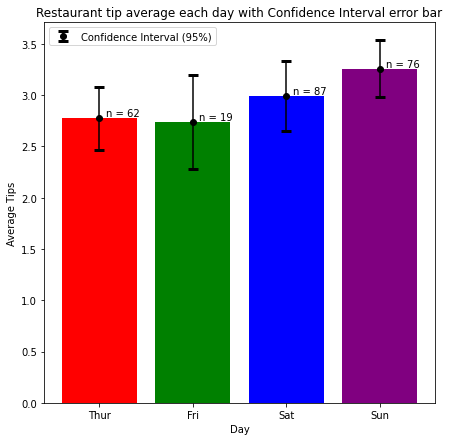

# 통계학 3주차 정규과제

📌통계학 정규과제는 매주 정해진 분량의 『*빅데이터 시대, 올바른 인사이트를 위한 통계 101×데이터 분석*』 을 읽고 학습하는 것입니다. 이번 주는 아래의 **Statistics_3rd_TIL**에 나열된 분량을 읽고 `학습 목표`에 맞게 공부하시면 됩니다.

아래의 문제를 풀어보며 학습 내용을 점검하세요. 문제를 해결하는 과정에서 개념을 스스로 정리하고, 필요한 경우 추가자료와 교재를 다시 참고하여 보완하는 것이 좋습니다.


## Statistics_3rd_TIL

### 5장 가설검정
#### 01. 가설검정의 원리
#### 02. 가설검정 시행
#### 03. 가설검정 관련 그래프
#### 04. 제1종 오류와 제2종 오류
### 6장 다양한 가설검정
#### 01. 다양한 가설검정
#### 02. 대푯값 비교
#### 03. 비율 비교


## Study Schedule

| 주차  | 공부 범위     | 완료 여부 |
| ----- | ------------- | --------- |
| 1주차 | p.16~45    | ✅         |
| 2주차 | p.48~115   | ✅         |
| 3주차 | p.118~173  | ✅         |
| 4주차 | p.176~220 | 🍽️         |
| 5주차 | p.221~287 | 🍽️         |
| 6주차 | p.290~334 | 🍽️         |
| 7주차 | p.338~394 | 🍽️         |

<br>

<!-- 여기까진 그대로 둬 주세요-->


# 1️⃣ 개념 정리 
## 01. 가설검정의 원리

```
✅ 학습 목표 :
* 가설검정의 원리에 대해 설명할 수 있다.
* 통계적에서의 가설을 이해한다.
```

### [ **확증적 자료분석 / 탐색적 자료분석** ]
**`확증적 자료분석`** : 미리 세운 가설을 검증하는 접근법 (*가설검증형 데이터 분석*)  
**`탐색적 자료분석`** : 가설을 미리 세우지 않고, 전체 데이터를 탐색적으로 해석  
- 데이터의 특징이나 경향을 파악
- 가설 후보를 찾는 것이 목적  

### [ **군(그룹)** ]
: 특정 동일 조건인 집단  
- **실험군(treatment group)** : 어떠한 **조치**를 취한 집단
- **대조군(control group)** : 실험군과의 **비교/대조**를 위해 마련한 집단

### [ **가설** ]
: 상정한 가설을 확인하고자 그 부정명제인 **귀무가설**을 세우고, 이 귀무가설이 틀렸음을 주장하는 것으로 **대립가설을 지지**하는 흐름
- **귀무가설(null hypothesis)** : 밝히고자 하는 가설의 부정 명제
- **대립가설(alternative hypothesis)** : 밝히고 싶은 가설   
⚠️ 가설은 모집단을 대상으로 한 가설이지, 표본(데이터)를 대상으로 한 가설은 아님!  
⚠️ 대립가설을 부정하여 귀무가설을 지지하는 것은 불가능!

> 📂 ***모집단과 표본의 관계***  
> 표본평균과 모집단 평균은 같지 않음. 어긋남이 존재(표본오차)  
> 즉, 귀무가설  `μₐ = μᵦ` 가 옳다 하더라도 `x̄ₐ ≠ x̄ᵦ` 가 됨  
> 즉, 표본평균의 차이가 귀무가설이 옳을떄도 생기는 **단순한 데이터 퍼짐** 인지  
> 아니면, 정말로 효과인지를 구별해야 함  

### [ **P-value** ]
: 귀무가설이 옳다고 가정했을 때 관찰한 값 이상으로 극단적이 값이 나올 확률  
***P-value가 작다는 것의 의미*** ) 귀무가설이 옳은 세계에서는 현실에서 얻은 데이터가 잘 나타나지 않는다는 뜻  

&nbsp; < **P-valu와 α를 이용한 가설 판정** >  
&nbsp;&nbsp; - *P-value < 0.05* : 귀무가설 기각, 대립가설 채택 ( ***통계적으로 유의미한 차이가 있다*** )    
&nbsp;&nbsp; - *P-value > 0.05* : 귀무가설 기각 불가 ( ***통계적으로 유의미한 차이를 발견하지 못했다*** )  
&nbsp;&nbsp; - **`유의수준 α`** : 귀무가설 채택, 기각의 판단 경계로 사용되는 값. 일반적으로 0.05  

<br>
<br>


## 02. 가설검정 시행 

```
✅ 학습 목표 :
* p값과 기각역에 대해 설명할 수 있다.
* 가설검정의 구체적인 예를 이해한다.
```

### [ **기각역** ]
: 계산된 검정통계량이 포함될 경우 **귀무가설을 기각(거부)하게 되는 영역**  
- **양측검정** : 양수와 음수 양쪽을 고려하는 가설검정 방법. 좌우로 유의수준의 1/2만큼의 꼬리에서 기각역 생김  
- **단측검정** : 어느 한 쪽만 고려해 넓이를 계산

### [ **가설검정의 구체적인 예** ]
1. 두 집단의 평균값을 비교하는 t 검정  
    - 귀무가설 : 두 집단의 모평균이 같다 (ex) 신약과 위약은 차이가 없다 
    - 대립가설 : 두 집단의 모평균은 다르다  (ex) 신약은 효과가 있다  
2. 각각 집단의 데이터에서 표본평균, 비편향 표준편차 s 계산
3. 해당 값을 통해 검정통계량 t 계산
4. 귀무가설이 옳다는 가정하에 t가 따르는 분포를 그리고 t값의 위치를 찾는다
5. +t 이상, -t 이하가 될 확률을 구한다 > 이 넓이의 합이 P-value
6. P-value가 유의수준보다 작으면 귀무가설 기각  (ex) 신약은 효과가 있다  

<br>
<br>

## 03. 가설검정 관련 그래프
```
✅ 학습 목표 :
* 오차막대에 대해 설명할 수 있다.
* '통계적으로 유의미'의 의미를 이해한다.
```
### [ **오차막대(error bar)** ]
: 막대그래프나 산점도 그래프를 그릴 때, 이에 더하여 위아래로 오차 막대를 그린다 
&nbsp; ex) 평균값을 비교하고 싶은 경우 막대그래프 상단 위아래로 표준오차를 표시  
\>>> **오차막대가 무엇을 표시하고 있는지를 그래프 범례**에 기재해야 함  
  

> ✴️ ***통계적으로 유의미함을 나타내는 표기***  
>  
> **`*`** : 통계적으로 유의미함을 나타냄  
> 단, 별표가 무엇을 의미하는지는 반드시 그래프 범례에 기재해야 함  
> **`NS(non-significant)`** : 유의미하지 않다  

<br>
<br>


## 04. 제1종 오류와 제2종 오류

```
✅ 학습 목표 :
* 제1종 오류와 제2종 오류의 개념을 구분하고 설명할 수 있다.
* 유의수준 α와 제1종 오류의 관계를 이해한다.
* 제2종 오류 β와 검정력(1-β)의 의미를 이해한다.
* α와 β의 상충 관계를 설명할 수 있다.
* 표본크기와 효과크기가 검정력에 미치는 영향을 이해한다.
```

### [ **진실과 판단의 4패턴** ]
|      | 귀무가설이 옳음 | 대립가설이 옳음 |
| ---- | ----------- | ----------- | 
| 귀무가설을 기각하지 않음 |  OK  |  제2종 오류(β) | 
| 귀무가설 기각 / 대립가설 채택 | 제1종 오류(α) | OK |   
- **`제1종 오류`** : 살제로는 아무런 차이가 없는데도 차이가 있다고 판단해 버리는 잘못  
    - 유의수준 α의 값을 미리 정해둠으로써 제1종 오류가 일어날 확률을 통제할 수 있음      
- **`제2종 오류`** : 정말 차이가 있는데도 차이가 있다고 말할수 없어, 귀무가설을 기각하지 않는 판단을 내려버리는 것  
    - **`검정력`** = `1-β` : 정말로 차이가 있을 때 차이가 있다고 올바르게 판단할 확률  
    - 일반적으로 검정력을 80%로 설정, but β는 α와 달리 직접 통제할 수 없음  
    (*표본크기에 따라 달라지기 때문*)  
<br> 
> 📂 ***α와 β는 상충관계를 가진다***  
> : **한쪽이 작아지면 또 다른 한쪽은 커지**는 관계가 존재  
> 연구분야, 연구 목적에 따라 어디에 중점을 둘지 결정하게 되지만, 일반적으로 α=0.05 사용  

<br>    

### [ **효과크기(effect size)** ]  
: 얼마나 큰 효과가 있는지 나타내는 지표
> 📂 ***ex) 두개 집단의 평균값 비교***  
> `d = (μₐ - μᵦ) / σ` 을 통해 단순히 평균값의 절대적 차이에만 주목하는 것이 아니라  
> 모집단 데이터 퍼짐에 대해 상대적으로 평가한 값을 통해 효과 크기를 알 수 있다  
> - 표준편차σ가 클수록 두 분포의 겹치는 부분 많아짐 > 효과크기d 작아짐 > 평균값의 차이 검출 어려움  
> - 표준편차σ가 작을술고 두 분포의 겹치는 부분 작아짐 > 효과크기d 작아짐 > 평균값의 차이 검출 easy   
> ⚠️ α, β, n, d 중에 3개의 값을 결정하면 나머지 하나 자동으로 정해짐  


## 05. 다양한 가설검정

```
✅ 학습 목표 :
* 가설검정 방법의 구분 요령을 이해한다.
* 다양한 가설검정 방법에 대해 설명할 수 있다.
```
### [ **가설검정 해석의 흐름** ]  
1. 확인하고 싶은 대상에 따라 **귀무가설, 대립가설 설정**
2. 데이터로 **검정통계량 계산**
3. 귀무가설이 옳다는 가정하에 **통계량의 분포를 생각**하고, 데이터로 계산한 통계량이 분포의 어느 위치에 있는지 구하여 **p-value 계산**  

⭐️ *가설검정 방법을 선택할 때에는 **데이터 유형, 표본의 수, 양적 변수 분포의 성질**을 먼저 확인한다!*  

- <u>***데이터유형***</u>  
&nbsp; &nbsp; : 데이터 유형이 양적변수인지, 질적변수인지 확인   
    - **분할표**(contingency table) : 각 상태에 몇개 데이터가 있는지 나타내는 표  
    - **산점도**(scatter plot) : 데이터 포인트를 표시해 2개의 양적변수들간의 관계를 나타냄  

- <u>***표본의 수***</u>  
    - *1표본인 경우*: 특정 1개의 모집단분포에 대해 세운가설을 검증 
    - *2표본 이상인 경우* : 표본끼리 **비교**하여 집단간 차이를 조사   

- <u>***양적 변수의 성질***</u>  
&nbsp; &nbsp; : 데이터에 양적변수가 있는 경우 그 **분포에 따라 검정 방법을 선택**해야 함  
    - **모수검정**(parametric test) : 모집단이 수학적으로 다룰 수 있는 특정 분포를 따른다는 가정을 둔 가설검정    
    +) **정규성**(normailty) : 데이터가 정규분포로 부터 얻어졌다고 간주할 수 있는 성질 
    - **비모수검정**(nonparametric test) : 모집단 분포가 특정 분포라고 가정할 수 없는 경우(좌우 비대칭분포, 이상값 존재 등) 모수에 기반을 두지 않고 검정하는 방법  
<br> 
<br> 

## 06. 대푯값 비교

```
✅ 학습 목표 :
* 모수 검정의 평균값 비교에 대해 설명할 수 있다.
* 적절하지 않은 검정을 사용하면 어떻게 되는지 설명할 수 있다.
* 비모수 검정의 대푯값 비교에 대해 설명할 수 있다.
* 자유도와 분산분에 대해 설명할 수 있다.
* 다중비교 검정에 대해 설명할 수 있다.
```

### [ **모수 검정의 평균값 비교** ]  
### 일표본 t검정  
: 어떤 평균의 모집단에서 표본을 얻었는가를 검정
- 귀무가설 : 모집단의 평균은 𝜇 = x 이다
- 대립가설 : 모집단의 평균은 𝜇 = x 이 아니다  

### 이표본 t검정  
: 2개 집단의 평균값을 비교 
- 귀무가설 : 2개 집단의 평균값은 같다
- 대립가설 : 2개 집단의 평균값은 다르다  
\> 모수검정 방법이기 떄문에 데이터에 **'정규성'** 이 있어야 함  

> 📂 ***정규성 조사***
> - Q-Q플롯 : 시각적으로 판단 간으
> - 샤피로-윌크 검정 : 가설검정으로 조사
> - 콜모고로프-스미르노프(K-S)검정 : 이론적인 분포와 비교  

> 📂 ***등분산성 조사***   
> : 데이터가 분산이 같은 모집단으로부터 획득되었다는 조건을 검정  
> ex) 바틀렛검정, 레빈검정 

<br> 

+) **웰치의 t검정** : 이표본 t검정에서 분산이 일치하지 않는 경우에 사용  
- 일반적인 t 검정을 개량한 것  
- 단, 정규성 가정은 만족해야 함

> 📂 ***대응관계가 없는/있는 검정***
> - '대응 관계가 없다' : 2개 집단의 피험자들 간에 대응관계가 없음
> - '대응 관계가 있다' : 한 피험자의 기준선과 비교해 얼마나 변화했는가를 알아봄

<br>  
<br>   

### [ **비모수 검정의 대표값 비교** ]  
*'각 집단 데이터에 정규성이 없는 경우 **비모수검정**을 사용하는 것이 권장된다*  
*이 떄는 평균값 대신 분포의 **위치를 나타내는 대푯값**에 주목하여 해석한다*
### 윌콕슨 순위합 검정 / 맨-휘트니 U 검정
: 어떤 평균의 모집단에서 표본을 얻었는가를 검정
- 귀무가설 : 2개 모집단의 위치가 같다
- 대립가설 : 2개 모집단의 위치가 다르다  
- 분포가 정규분포를 따르지 않아도 괜찮지만, 분포 모양이 같아야함 (분산이 다르면 안됨)  
+) 3집단 이상의 비모수검정 : 크러스컬-월리스 검정, 스틸-드와스 검정, 스틸검정  

<br>  
<br>   

### [ **분산분석** ]  
### ANOVA : 3개집단 이상의 평균값 비교  
- 귀무가설 : 모든 집단의 평균이 같다
- 대립가설 : 적어도 한 쌍에는 차이가 있다

- `집단내 변동` : 원래 존재하는 무작위 오차의 크기
- `집단간 변동` : 집단 간의 차이를 나타냄
- 검정통계량 F = (평균적인 집단 간 변동)/(평균적인 집단 내 변동)  
<br>   

### [ **다중비교검정** ]  
*`다중성문제`* : 집단이 n개인 경우 집단의 수가 늘어날수록 제1종 오류가 일어나기 쉬워짐  
\>>> 이 다중성 문제를 회피하기 위해 **다중비교 검정** 사용  
\>>> **기본아이디어)** 검정을 반복하는 만큼 **유의수준을 엄격한 값으로 변경**하자  
- **본페로니 교정** : 유의수준을 설정했을 때 검정반복횟수를 k라고 하고, 매 검정에서 유의수준 α를 검정횟수로 나눈 α/k 를 기준으로 가설검정을 하는 방법  
- **튜키 검정** : 본페로니 교정의 검정력이 낮다는 단점을 개선한 방법. 모든 쌍을 비교
- **던넷 검정** : 대조군과의 비교에만 관심이있는 경우 
- **윌리엄스 검정** : 집단간의 순위를 매길 수 있는 경우


## 07. 비율 비교

```
✅ 학습 목표 :
* 이항검정의 개념을 이해한다.
* 카이제곱검정의 적합도 및 독립성 검정에 대해 설명할 수 있다.
```

> ***범주형 데이터*** 
> : 데이터가 수치가 아닌 범주로 나타나는 경우  
> -> 범주형 변수에서도 모집단의 파라미터를 추정하거나 가설검정 가능!  

### [ **이항검정(binomial test)** ] 
: 하나의 범주가 확률 `p`, 나머지 하나의 범주가 `1-p`로 나타나는지 조사  

### [ **카이제곱검정 : 적합도 검정** ] 
*`적합도 검정`* : 얻은 출현도수가 이론적인 비율에 따라 얻어진 것인지를 조사하는 검정
- 귀무가설 : 모집단은 상정한 이산확률분포이다
- 대립가설 : 모집단은 상정한 이산확률분포가 아니다
1. 귀무가설의 확률분포에서 얻을 수 있는 기대도수를 게산  
    (*기대도수 : 전체개수 x 각 확률* )
2. (실제 출현도수 -기대도수)^2 / (기대도수) 를 계산하고 sum
3. 이 검정통계량 같이 분포에서 어디서 위치하는 지를 파악해 검정

### [ **카이제곱검정 : 독립성 검정** ] 
*`독립성 검정`* : 2개의 범주형 변수가 서로 독립인지 조사하는 검정
- 귀무가설 : 2개의 변수는 독립이다
- 대립가설 : 2개의 변수는 독립이 아니다

<br>
<br>

# 2️⃣ 확인 문제

## 문제 1.

> **🧚Q. 한 연구자가 두 개의 독립된 집단(A, B)의 고객 만족도 점수를 비교하고자 한다.
만족도는 1점부터 5점까지의 서열척도(리커트 척도)이며,
표본 수는 각 집단당 12명으로 적고, 정규성도 만족하지 않았다.
그러나 연구자는 이를 고려하지 않고 독립표본 t-검정을 사용하였다.**

> **이 분석 방법의 문제점을 설명하고, 왜 윌콕슨 순위합검정(Mann-Whitney U 검정)이 더 적절한지 서술하시오.**


```
정규성이 만족되지 않은 경우에는 비모수적 검정을 사용해야 한다(독립표본 t-검정은 모수검정)
따라서 비모수 검정의 대표값 비교 방법인 윌콕슨 순위합검정이 더 적절하다.
```


### 🎉 수고하셨습니다.
