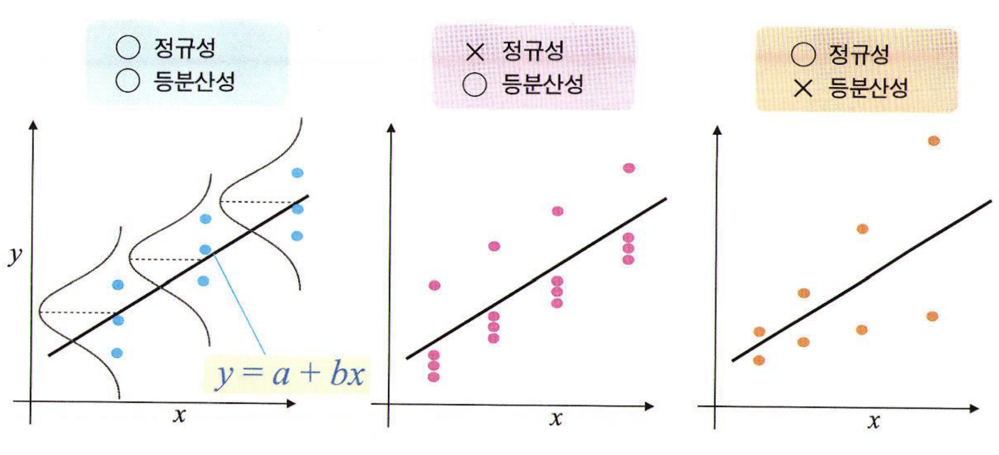
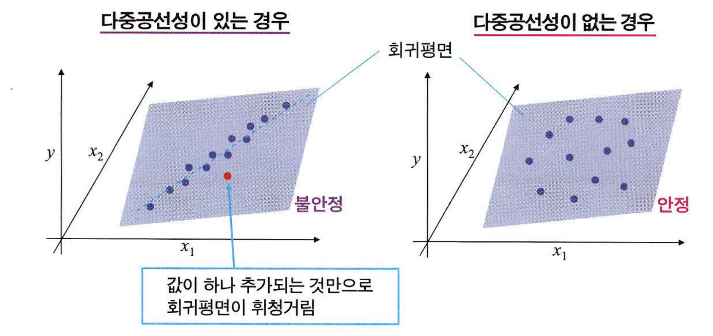

# 통계학 4주차 정규과제

📌통계학 정규과제는 매주 정해진 분량의 『*빅데이터 시대, 올바른 인사이트를 위한 통계 101×데이터 분석*』 을 읽고 학습하는 것입니다. 이번 주는 아래의 **Statistics_4th_TIL**에 나열된 분량을 읽고 `학습 목표`에 맞게 공부하시면 됩니다.

아래의 문제를 풀어보며 학습 내용을 점검하세요. 문제를 해결하는 과정에서 개념을 스스로 정리하고, 필요한 경우 추가자료와 교재를 다시 참고하여 보완하는 것이 좋습니다.


## Statistics_4th_TIL

### 7장 상관과 회귀
#### 01. 양적 변수 사이의 관계를 밝히다
#### 02. 상관관계
#### 03. 선형회귀
### 8장 통계 모형화
#### 01. 선형회귀 원리의 확장


## Study Schedule

| 주차  | 공부 범위     | 완료 여부 |
| ----- | ------------- | --------- |
| 1주차 | p.16~45    | ✅         |
| 2주차 | p.48~115   | ✅         |
| 3주차 | p.118~173  | ✅         |
| 4주차 | p.176~220 | ✅         |
| 5주차 | p.221~287 | 🍽️         |
| 6주차 | p.290~334 | 🍽️         |
| 7주차 | p.338~394 | 🍽️         |

<br>

<!-- 여기까진 그대로 둬 주세요-->


# 1️⃣ 개념 정리 
## 01. 양적 변수 사이의 관계를 밝히다

```
✅ 학습 목표 :
* 상관과 회귀에 대해 이해한다.
```
***"양적변수 사이의 관계를 분석하는 방법: 상관 & 회귀"***
> ➕ ***산점도 scatter plot***  
> 2개의 양적변수로 이루어진 데이터를 1개 변수를 x축, 1개 변수를 y축에 하여 값을 2차원 평면위의 점으로 나타낸 그래프

### **[ 상관 correlation ]**
: 2개의 확률변수 또는 데이터 사이의 관계성  
⚠️ **단, 상관이 있다고 해서 원인과 결과를 뜻하는 인과관계가 있는지까지는 알 수 없다!**  

### **[ 회귀 regressioin ]**
: y = f(x)라는 함수를 통해 변수 사이의 관계를 공식화하는 것   
-> 가진 데이터에 잘 들어맞는 함수 f(x)를 추정하고 2개 변수간의 관계를 구하는 원리 
- x : 설명변수, 독립변수
- y : 반응변수, 종속변수  

&nbsp; *ex) x = 광고비용, y = 상품판매개수*  
&nbsp; &nbsp; &nbsp; &nbsp; &nbsp; ***회귀식 : y = 0.001\*x***  
&nbsp; &nbsp; &nbsp; &nbsp; &nbsp; *해석 : 광고비용이 1000원 오를때 상품 판매 개수는 1이 늘어남*  

✅ **상관과의 차이점!**  회귀에서는 X->Y라는 **방향성이 존재함**


<br>
<br>
<br>


## 02. 상관관계

```
✅ 학습 목표 :
* 피어슨 상관계수의 개념과 특징에 대해 설명할 수 있다.
* 비모수 상관계수에 대해 설명할 수 있다.
* 상관계수의 유의성 검정과 p값·표본크기의 영향을 이해한다.
```
### **[ 피어슨 상관계수 r ]**
: 2개의 양적 변수 사이의 선형관계가 얼마나 직선 관계에 가까운가를 평가  
$$
r = \frac{
\frac{1}{n} \sum_{i=1}^{n} (x_i - \bar{x})(y_i - \bar{y})
}{
\sqrt{
\frac{1}{n} \sum_{j=1}^{n} (x_j - \bar{x})^2
}
\sqrt{
\frac{1}{n} \sum_{k=1}^{n} (y_k - \bar{y})^2
}
}
$$
- -1 ≤ r ≤ 1 
- **양의 상관 positive correlation** : 상관계수의 부호가 양수. x와 y의 방향이 같은 방향으로 움직임
- **음의 상관 negative correlation** : 상관계수이 부호가 음수. x와 y의 방향이 반대 방향으로 움직임  

<br> 


[ **절댓값에 따른 상관의 강도** ]   
| 범위 | 상관 강도 |
|----------------|----------------|
| $0.7 < \|r\| \leq 1$ | 강한 상관 |
|  $0.4 < \|r\| \leq 0.7$ | 중간 정도 상관 |
| $0.2 < \|r\| \leq 0.4$ | 약한 상관 |
| $0.0 < \|r\| \leq 0.2$ | 거의 상관없음 |   

\>>> 다만 정확한 해석은 도메인에 따라 달라지기 때문에 그때그때 알맞게 해석해야 함  
<br>  

[ **상관계수 해석의 유의점** ]  
⚠️ 상관계수는 2개의 양적변수의 **선형**관계성 정도를 정량화 한것임. 즉, 변수 사이에 명확한 관계가 있음에도 **비선형 관계인 경우 상관계수로는 적절하게 정량화 할 수 없다!**  
⚠️ '강도'를 정량화 하는 것이기에 **직선의 기울기 크기는 관계가 없다**. 기울기는 다르나 직선에서의 데이터 퍼짐 정도가 같은 경우 상관계수는 같에 나옴   
<br>  

[ **정규성 검사** ]  
: 피어슨 상관계수는 **모수적 방법** 즉, **정규성 가정이 필요하다**  
\> 즉, 데이터가 치우침이 있거나, 쌍봉형, 이상값 존재시 적절하지 않다!


<br>
<br>
<br>

### **[ 비모수 상관계수 ]**
*아까 본 바와 같이 피어슨 상관계수는 정규성 가정이 필요. 그럼 정규분포에서 벗어난 데이터는 어떻게 상관계수를 측정하면 좋을까?*  

[ **스피어만 상관계수 ρ** ]  
: 데이터의 x축, y축 중 적어도 하나 이상에 정규성이 없는 경우  
-> 양적 데이터의 값 자체가 아니라 그 데이터 값의 순위를 이용하여 계산됨 

[ **켄달 순위상관계수 τ** ]  
: 스피어만 상관계수와 거의 비슷하나 **표본크기 n이 매우 작을 때** 사용하면 더 좋음   

[ **상관계수 사용시 주의점** ]  
⚠️ ***2개 변수가 처음부터 종속 관계인 경우 주의 필요***  
x축과 y축의 값이 개별 변수일 것, 나눗셈으로 변환하지 않았을 것을 확인필요!  
그렇지 않은 경우 각 개별 변수들이 무상관이라고 해도 상관이 나타나게 되버림  

<br>

### **[ 상관계수와 가설 ]**
[ **상관계수의 가설검정** ] 

표본 상관계수 r은 모집단 상관계수의 추정치  
모집단이 같더라도 표본마다 r 값은 달라짐 (표본 변동성 존재)

**표본 상관계수의 분포)**   
- 모집단 상관계수 r = 0이어도 표본 r은 0이 아닌 값이 나올 수 있음
- 평균: 0 근처
- 대부분 작은 값 / 드물게 큰 값 (예: ±0.4 이상)도 발생  

\>>> 즉, 우연히 큰 상관계수도 나올 수 있음

<br>

[ **가설검정 절차** ]   
> 귀무가설 H_0: r = 0 / 대립가설 H_1: r ≠ 0  

p-value 사용해서 검정한다   
- p < 0.05: 유의 → 상관 있음
- p ≥  0.05: 유의하지 않음 → 상관 있다고 보기 어려움

\>>> 단순히 r 값이 커도 p-value가 크면 유의하지 않음

<br>

[ **표본크기와 가설검정** ]   
**주의점⚠️)** 표본 크기 n이 커질수록 아주 작은 상관도 유의하게 나올 수 있음  
\> 즉, **r 값과 p-value를 동시에 보아서** 그 크기를 해석해야 한다!

<br>
<br>

### **[ 비선형 상관 ]**
*"앞서본 상관계수들은 **비선형 관계를 다룰 수 없음!** 최근 더 포괄적인 상관의 우너리로서 정보량에 기반을 둔 지표가 제안되고 있다~"*  

**`비선형 상관`** : x가 y에 관해, 또는 y가 x에 관해 **어느 정도의 정보를 포함하는지의 관점에서 관계성 강도를 정량화** 하는 것!  

<br>
<br>
<br>
<br>


## 03. 선형회귀
```
✅ 학습 목표 :
* 최소제곱법의 원리를 이해한다. 
* 회귀계수의 가설검정에 대해 설명할 수 있다.
* 결정계수에 대해 설명할 수 있다.
* 오차의 등분산성과 정규성에 대해 설명할 수 있다.
* 설명변수와 반응변수에 대해 설명할 수 있다.
```

### **[ 회귀분석의 기본 ]**
**회귀모형(regression model)**
$$
y = a + bx + e
$$
- **회귀계수** : 회귀식의 형태를 결정하는 파라미터 a,b,c (아직 미지수)
- 특정 평가기준에 따라 **회귀의 적합도를 평가**하고 이 회귀계수 값을 구체적으로 구하는 것이 회귀분석의 큰 흐름


### **[ 최소제곱법 ]**
✅ 우리의 목표는 **데이터에 가능한 들어맞는 회귀모형**을 찾는 것!  
➡️ 즉, **데이터와 회귀식의 차이가 가능한 작은** 모형을 찾아야 한다

$$
E(a,b) = \sum_{i=1}^{n} (\hat{y}_i - y_i)^2 
= \sum_{i=1}^{n} (a + b x_i - y_i)^2
$$
잔차 제곱합 E(a,b)를 최소화하는 a와 b를 편미분을 통해서 풀어 가장 적잘한 회귀계수를 찾아낸다  
(즉, 회귀식은 잔차제곱합이 가장 작아지게 하는 방식이지 회귀직선 상에 모든 데이터 점이 나타나게 하는 것은 아니다)   

<br>


### **[ 회귀계수 ]**
> ➕ ***오차항에 대한 가정***  
> : 오차항은 **x와는 관계가 없고 평균0, 분산 sigma^2인 어떤 확률분포**(정규분포 가정 필요x)를 따르는 확률 변수라 가정   
\>>> 이떄, 최소제곱법으로 얻은 선형회귀 파라미터는 모집단 파라미터의 **비편향 추정량**이 됨

**[ 최량선형비편향추정량 ]**  
: **분산이 일정하다는 가정**하에서 최소제곱법으로 얻은 추정량은 비편향 추정량 중에서도 **가장 정밀도가 높은 비편향 추정량**이 됨. 이 추청량을 **최량선형비편향추정량**이라고 함.

**[ 회귀계수의 가설검정 ]**   
*가정) 1. 오차항은 x와는 관계가 없고 평균0, 분산 sigma^2*  
&nbsp;&nbsp;&nbsp;&nbsp;&nbsp;&nbsp;&nbsp;&nbsp; *2. 오차항의 분포는 **정규분포**(단, 표본크기 n이 크면 가정2 필요없음)*
> **귀무가설 H_0: b = 0 / 대립가설 H_1: b ≠ 0**   
> *귀무가설이 옳다면 회귀식에서 x term이 날라감으로 설명변수 x값에 대해 y는 아무 변화 없다는 뜻*
- **95% 신뢰구간** : 동일한 방법으로 표본추출&회귀분석을 100번 시행했더니 100번 중에 95번 정도는 이 범위에 모집단의 모형이 포함되었다는 의미
- **95% 예측구간** : 얻을 수 있는 데이터의 95%를 포함하는 범위(데이터 그 자체가 분포하는 구간)

<br>

### **[ 결정계수 R-squared ]**
: 회귀식이 잘 들어맞는지 평가하는 지표  
$$
R^2 = 1 - \frac{\sum_{i=1}^{n}(y_i - \hat{y}_i)^2}{\sum_{i=1}^{n}(y_i - \bar{y})^2}
$$
- 분모 : 반응변수 전체의 분산
- 분자 : 회귀모형과 실제 데이터의 잔차 제곱합
- 1에서 이 분수를 뻄으로서 데이터에 의해 설명된 비율을 나타냄  
- **1에 가까울 수록 회귀모형이 데이터에 잘 들어맞고, 0에 가까우수록 잘 들어맞지 않음을 의미**

❎ *problem)* 설명변수의 개수가 늘어날술고 커지는 성질이 있어 의미없는 설명변수를 도입하면 실제론 그렇지 않은데도 회귀모형의 설명력이 향상된 것처럼 보일 수 있음   
➡️ *solution)* **`조정 결정계수`**  
&nbsp;&nbsp;: 설명변수 개수 k에 따라 조정함
$$
\bar{R}^2 = 1 - \left( \frac{n-1}{n-k-1} \right)\left(1 - R^2\right)
$$ 


<br>
<br>

### **[ 오차의 등분산성과 정규성 ]**  
  
- 왼쪽 : 오차가 정규분포를 따르고 x가 변하더라도 오차의 분산은 변하지 않는 경우
- 가운데 : 오차가 정규분포를 따르지는 않지만 오차의 분산은 변하지 않는 경우
- 오른쪽 : 정규분포를 가지지만 x에 따라 오차의 분산이 달라지는 경우 

**[ 브루쉬-페이건 검정 / BP검정 ]**  
: 등분산성을 확인하기 위해 설명변수 x가 변할 때 잔차의 분산이 달라지는 지를 조하나는 검정

<br>
<br>
<br>


## 04. 선형회귀 원리의 확장

```
✅ 학습 목표 :
* 다중회귀를 이해하고 그 결과를 읽을 수 있다.
* 편회귀계수의 의미를 이해하고 해석할 수 있다.
* 범주형 변수를 더미변수로 변환하는 방법과 회귀계수의 해석을 이해한다.
* 공분산분석에 대해 설명할 수 있다.
* 다중공선성에 대해 이해한다.
```

### **[ 디중회귀 ]**
: 설명변수가 여러개인 회귀모형  
**다중선형회귀식 )**  
$$
y = a + b_1 x_1 + b_2 x_2 + \cdots + b_k x_k + \varepsilon
$$
- **편회귀계수** : 기울기 $b_1$, $b_2$ ...을 다중회귀에서는 편회귀계수라고 부른다
- **회귀평면** : 설명변수가 2개일 때 그래프를 그리면 회귀모형은 직선이 아닌 평면에 위치함  

### **[ 편회귀계수 ]**  
: $x_i$이외의 설명변수를 고정한 채로 $x_i$가 늘어났을 때의 y의 증가량을 나타냄  

**[ 표준화편회귀계수 ]**  
: 편회귀계수는 설명변수의 데이터 퍼짐 정도나 단위에 따라 크게 달라지기 때문에 편회귀계수끼리 비교할 수 없음. 이를 해결하기 위해 표준화편회귀계수 사용!  

\>>> **`표준화편회귀계수`** : 회귀분석을 시행하기 전에 각각의 설명변수를 평균0, 표준편차1로 변환한 다음 회귀분석을 시행하여 구한 회귀계수   

- 각 설명변수가 **표준편차 단위**에서 1늘었을 때 반응변수의 증감을 나타냄
- 원래 데이터 퍼집 크기를 기준으로 평가할 수 있으므로 **비교가 가능!**

<br>

### **[ 범주형 변수를 설명변수로 ]**
*"지금까지는 양적 변수가 설명변수였음. 하지만 범주로 나타낸 데이터를 설명변수로 사용할 수 있을까?"*  

**`가변수 dummy variable`** : 범주에는 대소관계가 없으므로 0과 1과 같은 가변수를 설명변수로 이용할 수 있다!  
*ex) 좋음 = 0 , 싫음 = 1*   

*=> 범주가 3개 이상이라면?*  

**`가변수를 (범주개수-1)개 준비해 원핫인코딩`**  
- 가변수를 0,1,2,3 이렇게 부여할 수는 없음 (**대소관계가 없으니까**)
- (0,0,0)  (0,0,1) (0,1,0) (1,0,0) 과 같이 부여

<br>

### **[ 공분산분석 ANCOVA ]**
: 일반적인 분산분석에 사용하는 데이터와 함께 양적변수 데이터가 있는 경우 후보가 되는 방법으로 이 새로 추가한 양적변수를 **공변량(covariate)** 라고 함. 이 공변량의 차이에 따라 반응 변수의 차이가 발생할 가능성을 고려한 분석 가능    
> ☑️ ***회사원의 연소득 y가 회사 $x_1$의 차이에 따라 달라지는 지를 조사***  
> ***연소득에 영향을 주는 요인중 하나인 연령($x_2$) 데이터도 존재하는 상황!***  
> 연소득 = a + $b_1$ * $x_1$ + $b_2$ * $x_2$ + e  

**[ 공분산 분석의 사용조건 ]**
1. **집단 간 회귀의 기울기가 서로 다르지 않을 것**
2. **회귀계수가 0이 아닐 것**


<br>

### **[ 차원의 저주 ]**
: 차원이 늘어날 수록 **파라미터 추정에 필요한 데이터 양이 폭발적으로 증가**   
\>>>> ***Solution)*** 차원축소 방법을 사용해 차원을 줄일 수 있음  


<br>

### **[ 다중공선성 ]**
: 설명변수가 여러개인 다중회귀에서 설명변수 사이에 강한 상관이 있는 경우   
\>>>> ***problem)*** 회귀계수의 추정오차가 커지는 문제 발생 가능함(추정값의 신뢰성이 떨어진다)   

 
**[ 분산팽창인수 VIF ]**  
: 다중공선성 정도를 측정해줌  
$$
VIF_i = \frac{1}{1 - R_i^2}
$$
- 각 설명변수마다 산출됨
- 한 설명변수를 반응변수로 설정하고 나머지 설명변수를 이용하여 회귀를 시해앟ㄴ 뒤 그 결정계수를 계산하는 방식
- VIF > 10 : 2개 사이의 상관이 아주 강한 것 -> 즉 두 변수를 모두 포함한 회귀모델은 피해야함  


# 2️⃣ 확인 문제

## 문제 1.

🧚 **Q. 다음은 다중회귀분석 결과이다.**

한 연구자가 학생들의 공부시간(X₁), 수면시간(X₂), 학원 수강 여부(0=미수강, 1=수강)를 설명변수로 하여 시험 점수(Y)를 예측하는 다중회귀모형을 분석하였다.

분석 결과는 다음과 같다.

- 공부시간의 회귀계수: **2.5** (p < 0.01)  
- 수면시간의 회귀계수: **-0.8** (p = 0.20)  
- 학원 수강 여부의 회귀계수: **5.0** (p < 0.05)  
- 결정계수: **R² = 0.62**

---

### 다음 질문에 답하시오.

1️⃣ 각 회귀계수의 의미를 해석하시오.  

2️⃣ 통계적으로 유의한 변수는 무엇인가?  

3️⃣ R² = 0.62의 의미를 설명하시오.  

---

<!--조금 헷갈릴 수 있지만, 배운 개념을 하나씩 떠올리면서 천천히 생각해보면 충분히 풀 수 있어요!-->

```
1️⃣ 
공부시간 : 다른 변수가 동일할 때, 공부시간이 1 증가하면 시험 점수는 평균적으로 2.5 증가한다.
수면시간 : 다른 변수들이 동일할 때, 수면시간이 1시간 증가하면 시험 점수는 평균적으로 0.8점 감소한다. 단 p-vlaue가 유의하지 않아 통계적으로 유의미하다고 보기 어렵다. 
학원수강 여부 : 다른 변수들이 동일할 때, 학원을 수강한 학생은 미수강 학생보다 시험 점수가 평균적으로 5점 높다.
2️⃣ 
P-value가 0.05 보다 작아야 통계적으로 유의미하다고 할 수 있다. 따라서 공부시간, 학원수강여부 두 변수가 통계적으로 유의미하다. 
3️⃣ 
R²은 해당 변수들로 만들어진 회귀식이 데이터에 얼마나 들어맞는지를 0에서 1사이의 값으로 나타낸다. 현재 R²가 0.62이므로 이 회귀모형은 시험 점수의 변동 중 약 62%를 설명한다는 의미이다. 
```


### 🎉 수고하셨습니다.
